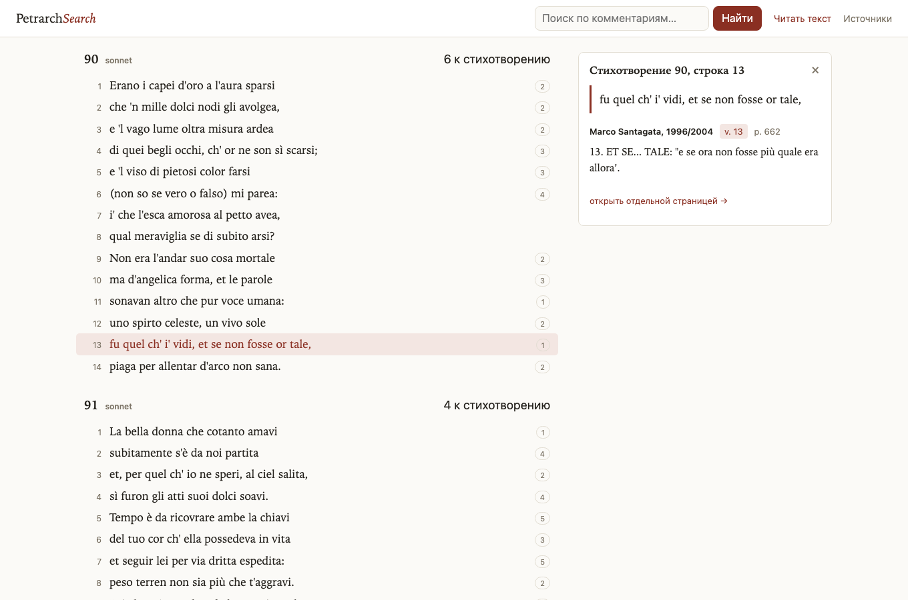
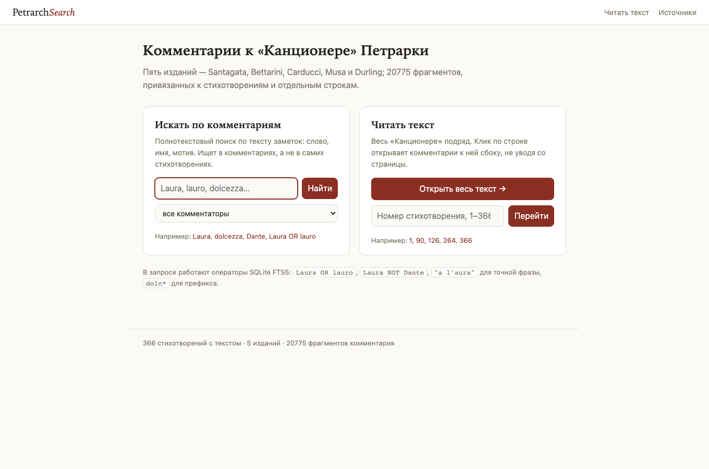
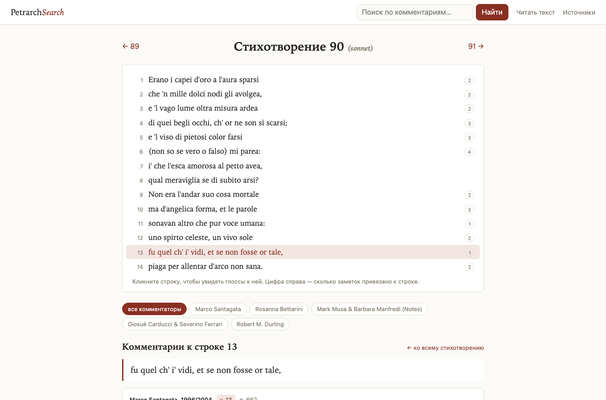
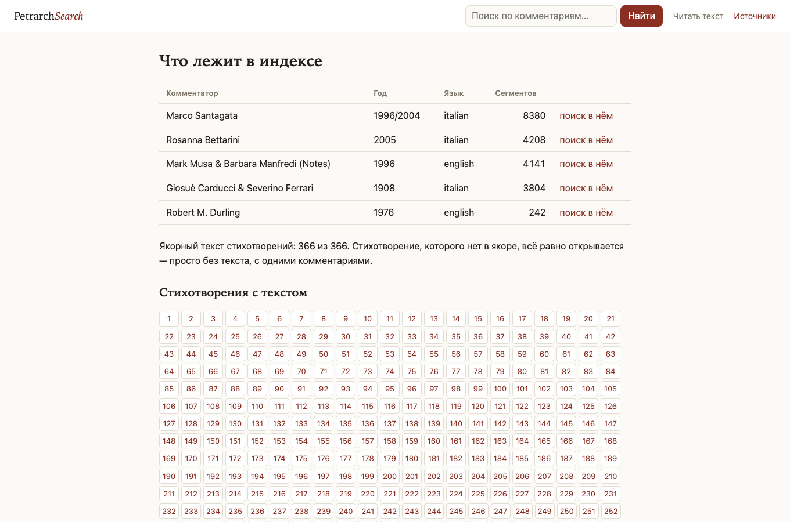

# Petrarch Search

Репозиторий: [github.com/fmxx8/petrarch_commentary](https://github.com/fmxx8/petrarch_commentary)

Чтение **Канцоньере** Петrarca (366 стихотворений, 7785 строк) вместе с комментариями пяти изданий: построчный поиск, сравнение gloss на одной строке, веб-интерфейс и CLI.

| Слой | Что это |
|------|---------|
| **Якорный текст** | Итальянский текст всех 366 стихотворений (нумерация Канцоньере) |
| **Комментарии** | Фрагменты gloss с привязкой к стихотворению и, где возможно, к строке |

Поиск идёт **по тексту комментариев**, не по стихотворениям.

<p align="center">
  
</p>
<p align="center"><em>Режим чтения <code>/read</code> — клик по строке открывает gloss всех комментаторов справа</em></p>

| | |
|:---:|:---:|
|  |  |
| <em>Поиск <code>/?q=Laura</code></em> | <em>Страница строки <code>/poem/90?line=13</code></em> |

<p align="center">
  
</p>
<p align="center"><em>Состав индекса — <code>/sources</code></em></p>

---

## Возможности

- **Режим чтения** (`/read`) — весь корпус одной прокруткой; клик по строке — gloss в боковой панели.
- **Поиск** (`/`) — полнотекстовый FTS5 по комментариям; фильтры по автору, стихотворению, строке.
- **Страница стихотворения** (`/poem/N`) — текст + заметки; клик по строке — построчные gloss всех источников.
- **CLI** — `search`, `show`, `at`, `index-stats` для работы в терминале.

---

## Установка и запуск

**Требования:** Python 3.11+

```bash
git clone https://github.com/fmxx8/petrarch_commentary.git
cd petrarch_commentary

python3 -m venv .venv
source .venv/bin/activate          # Windows: .venv\Scripts\activate
pip install -e ".[web]"

python scripts/build_index.py      # если в репо нет petrarch.db — ~30 сек
python -m petrarch_search serve
```

Откройте **http://127.0.0.1:8000/read**. Сервер слушает только localhost.

Проверка индекса:

```bash
python -m petrarch_search index-stats
# Poems: 366 | Commentaries: 5 | Segments: ~20775
```

### Адреса

| URL | Назначение |
|-----|------------|
| `/read` | Весь текст, комментарии по клику |
| `/read?focus=126` | Прыжок к стихотворению 126 |
| `/read?author=Marco+Santagata` | Один комментатор |
| `/` | Поиск по комментариям |
| `/poem/90?line=13` | Строка 13 sonetto 90 + все gloss |
| `/sources` | Состав индекса |

### CLI

```bash
python -m petrarch_search search "Laura" --author Santagata --limit 20
python -m petrarch_search show --poem 90 --author Bettarini
python -m petrarch_search at --poem 90 --line 13
python -m petrarch_search build-index
```

| Задача | Команда |
|--------|---------|
| Найти слово в комментариях | `search "Laura"` |
| Все заметки к sonetto 90 | `show --poem 90` |
| Gloss к строке 13 | `at --poem 90 --line 13` |
| Статистика базы | `index-stats` |

`show --poem N` без `--line` показывает только общие заметки к стихотворению; построчные gloss — `--all` или `--line L`.

---

## Источники

| Комментатор | Фильтр `--author` | Язык | Построчно |
|-------------|-------------------|------|-----------|
| Marco Santagata | `Santagata` | it | да |
| Rosanna Bettarini | `Bettarini` | it | да |
| Mark Musa & Barbara Manfredi | `Musa` / `Manfredi` | en | да |
| Giosuè Carducci & Severino Ferrari | `Carducci` | it | да |
| Robert M. Durling | `Durling` | en | poem-level |

**Якорный текст** — Robert M. Durling, *Petrarch's Lyric Poems* (Harvard UP, 1976).

---

## Структура проекта

```
petrarch_commentary/
  data/processed/
    canzoniere.json              # якорный текст 1–366
    commentaries/*.json          # сегменты по изданиям
    petrarch.db                  # SQLite + FTS5 (собирается build_index.py)
  scripts/
    build_index.py
    parse_*.py                     # парсеры PDF → JSON
  src/petrarch_search/
    cli.py, index.py
    web/                           # FastAPI + шаблоны
  docs/screenshots/
```

После изменения JSON в `data/processed/` пересоберите индекс:

```bash
python scripts/build_index.py
```

---

## Зависимости

Python 3.11+ · Typer · Rich · FastAPI · Jinja2 · SQLite FTS5 · PyMuPDF

```bash
pip install -e ".[web]"     # веб + CLI
pip install -e ".[ocr]"     # опционально: OCR PDF (Tesseract)
```

Список пакетов — в [`pyproject.toml`](pyproject.toml).
